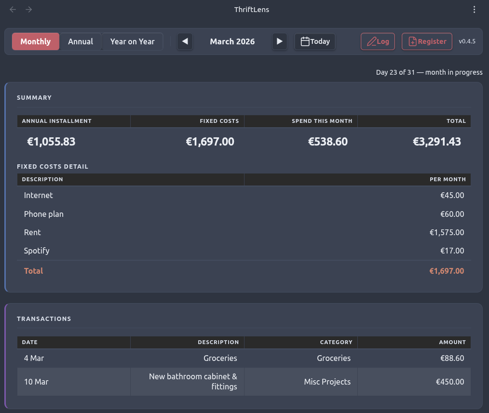
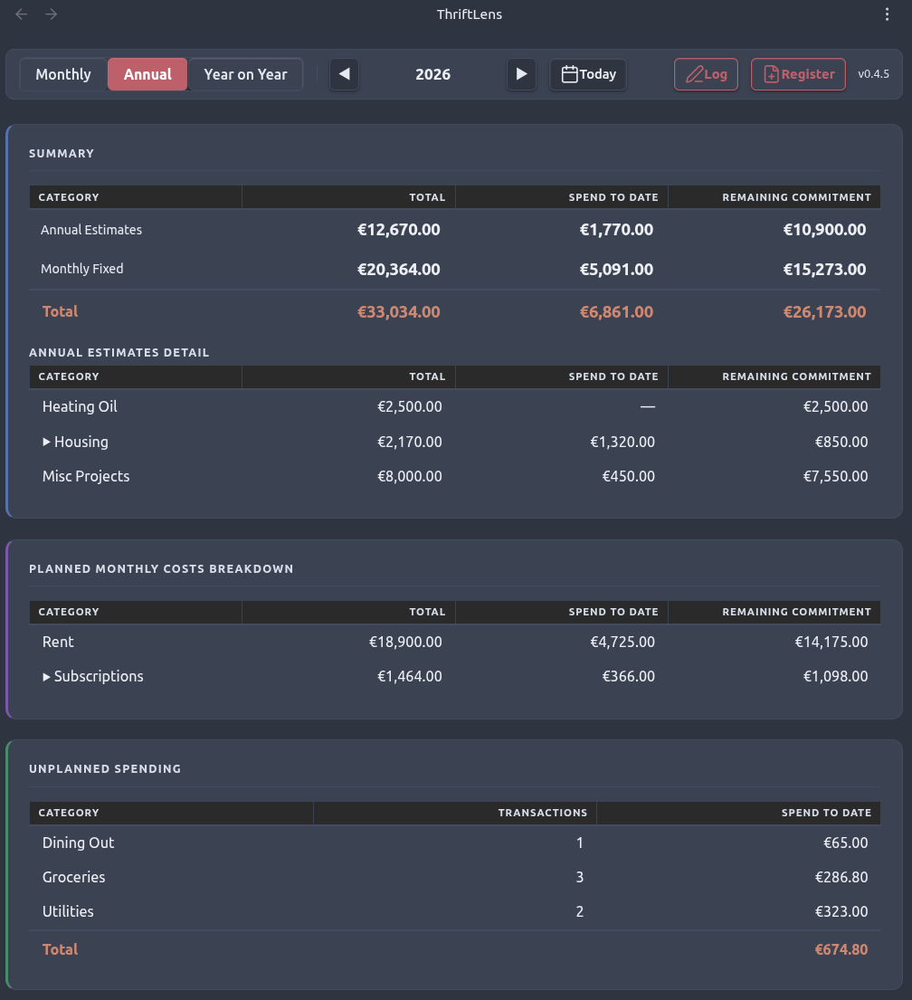
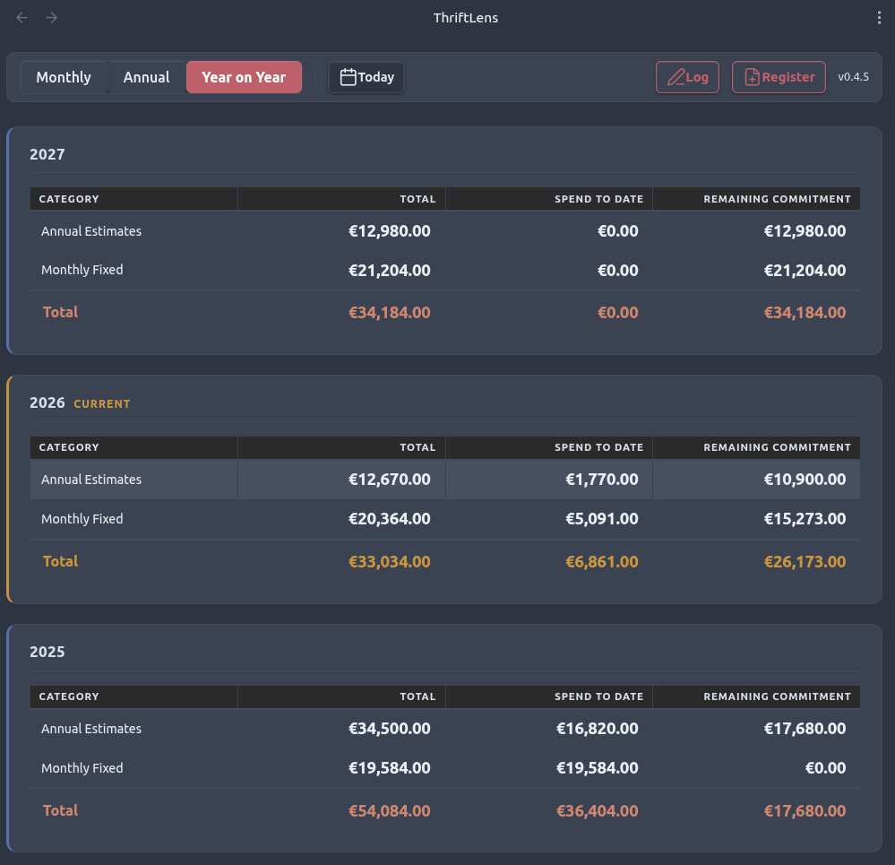

# ThriftLens

A personal cashflow dashboard for people who want to understand where their money goes, and see their cost of living.

---

## Philosophy

I built ThriftLens for my own needs, to track and understand - in advance - where my money goes. The question I want ThriftLens to answer, at any point in the year, is: *what does my ongoing cost of living actually look like right now?* 

The app is idiosyncratic - I aimed for simplicity and glance-view clarity over 'correct' accounting models. And the app is fatalistic - life is expense - so there's no 'budgeting'! But perhaps you'll find it useful.

**Money is committed before it is spent.** I want to see costs in advance. Insurance premiums are due every year. Rent is owed on the first of every month whether I've paid it or not. Heating oil will be needed in October whether I've budgeted for it or not. The cost of a holiday earmarked for summer is, in effect, already gone. I want my financial picture to reflect that abstraction - not wait for the bank statement to confirm it.

Some costs are only approximately known in advance - so the app earmarks a figure, drawn from what I actually spent on that category last year (you'll have to supply estimate amounts yourself for the first year). That reservation shows up in the dashboard immediately because that's the fatalistic picture. Estimates are forward commitments of things I know I'll have to spend on.

Apart from estimates, I'm not budgeting or setting aside pots of money here. Unplanned spending simply appears as actual spend records - no judgement. The dashboard shows me what it cost; I draw my own conclusions.

---

## Mental Model

Every entry in ThriftLens is one of three things:

**Monthly Fixed** — a recurring cost with a known, fixed monthly amount. Rent, a phone contract, a broadband subscription. These are commitments: the money is as good as spent the moment the month begins. The dashboard shows how much has accumulated to date based on months elapsed, without needing matching transaction records.

**Annual Estimate** — money earmarked for something that will cost roughly a known amount over the year. Heating oil, property tax before the bill arrives, a holiday, a home improvement project. You know roughly what it will cost and you are treating that money as spoken for. Once the actual bill arrives, the actual spend is recorded alongside — the estimate remains as the benchmark. Amount is treated as a full-year figure; the monthly view shows it amortised (÷ 12).

**Actual Spend** — a real transaction that has occurred. This may realise a planned expense (paying the heating oil bill) or be entirely ad hoc (an unplanned repair, a dinner out). Actual spend records are always taken at face value — no scaling applied.

### The three views

**Monthly view** shows the current month: what is committed this month (annual estimates amortised to a monthly figure, and fixed costs for the month), and what has actually been spent. It gives you a running picture of the month — how much is locked in, how much is paid.



**Annual view** shows the full year: the total committed baseline versus total actual spend, broken down by category. Annual estimates are matched against actuals by `spend_category`. Monthly fixed spend-to-date is computed as amount × months elapsed — no transaction matching needed. This is where you see whether your estimates are holding and how the year is tracking overall.



**Year on Year view** shows the annual summary table for every register in descending order, so you can compare your cost of living across years at a glance. The current year is highlighted.



### Spend categories

Every entry carries a `spend_category` slug (e.g. `rent`, `heating`, `driving`). This is the join key that connects planned and actual records for the same cost. It enables the dashboard to:

- Show actual spend for a category against its planned estimate
- Pre-fill next year's annual estimate amounts from this year's actuals for the same category
- Group and subtotal meaningfully without fuzzy description matching

Multiple plan records can share a `spend_category` to form a bucket — for example, several driving costs (insurance, road tax, servicing) all tagged `driving`. In the annual view, the bucket shows a combined total with an expandable row revealing the individual entries underneath.

**Choosing a category slug:** pick a slug that reflects the *planning behaviour* of the entry, not just its real-world meaning. A Nespresso subscription is fixed and known every month — it may belong in `subscriptions` even though the coffee itself is groceries. The description carries the semantic label; the category carries the planning grouping.

---

## Data Model

### Registers

Data lives in one Markdown file per year — called a **register** — stored in the vault's `thriftLens/` folder:

```
thriftLens/
  2024.md
  2025.md
  2026.md
```

Each register has a small frontmatter block identifying it, then a single fenced YAML block containing all entries for the year:

```markdown
---
tl_type: register
year: 2026
---

\```yaml
# ── Annual estimate ──────────────────────────────────
- date: 2026-01-01
  amount: 3000
  spend_type: annual_estimate
  spend_category: heating
  description: Heating Oil

# ── Monthly fixed ───────────────────────────────────
- date: 2026-01-01
  amount: 1575
  spend_type: monthly_fixed
  spend_category: rent
  description: Rent

# ── Actual spend ────────────────────────────────────
- date: 2026-03-12
  amount: 94.80
  spend_type: actual_spend
  spend_category: groceries
  description: Groceries
\```
```

### Entry schema

| Field | Type | Notes |
|---|---|---|
| `date` | `YYYY-MM-DD` | For `actual_spend`: the transaction date. For `monthly_fixed` and `annual_estimate`: conventionally `YYYY-01-01` |
| `amount` | number | No currency symbol; never negative. For `monthly_fixed`: the monthly amount. For `annual_estimate`: the full-year amount |
| `spend_type` | string | `monthly_fixed` · `annual_estimate` · `actual_spend` |
| `spend_category` | string | Short slug, e.g. `heating`, `rent`, `driving` |
| `description` | string | Free text label for this entry |
| `valid_until` | `YYYY-MM-DD` | Optional; `monthly_fixed` only; marks a mid-year expiry |

### Amount interpretation

| spend_type | Monthly view | Annual view |
|---|---|---|
| `monthly_fixed` | amount as-is | amount × months active in year |
| `annual_estimate` | amount ÷ 12 | amount as-is |
| `actual_spend` | face value | face value |

### Carry-forward rules

At year-end, next year's register is built from the current one:

| Entry type | Carry-forward behaviour |
|---|---|
| `monthly_fixed` | Carried over unchanged |
| `annual_estimate` | Amount pre-filled from the total actual spend for that `spend_category` this year; falls back to source amount if no actuals found |
| `actual_spend` | Never carried forward |

The **Plan next year** command presents a review step before writing anything. You adjust amounts, remove entries that no longer apply, add new ones, then confirm. Nothing is written until you do.

---

## Structure

```
thriftlens/
├── vault/                        Obsidian vault root
│   ├── thriftLens/               Register files (YYYY.md)
│   └── .obsidian/
│       └── plugins/thriftlens/   Built plugin output
└── plugin/                       Plugin source (TypeScript + esbuild)
    └── src/
        ├── main.ts
        ├── logic.ts              Pure business logic — no Obsidian imports
        ├── parser.ts             YAML block parsing and serialisation
        ├── loader.ts             Vault file reading
        ├── renderer.ts           DOM rendering
        ├── exporter.ts           HTML report generation
        ├── carryForward.ts       Carry-forward proposal logic
        ├── csvUtils.ts           Shared CSV parsing utilities
        ├── ThriftLensView.ts     ItemView subclass
        ├── settings.ts
        └── modals/
            ├── AddEntryModal.ts
            ├── CarryForwardModal.ts
            ├── CreateRecordModal.ts
            ├── ImportCsvModal.ts
            └── ExportCsvModal.ts
```

---

## Using ThriftLens

Install ThriftLens like any Obsidian community plugin, then click the hand-coins icon in the ribbon to open the dashboard.

### Navigation

The year label in the monthly and annual nav bars, and each year heading in the Year on Year view, can be clicked to open that year's register file directly in a new tab.

### Commands

**Log an expense** — opens a form to record a new entry in the current year's register. For `actual_spend` entries, enter the date in DD-MM-YYYY format. For `monthly_fixed` and `annual_estimate` entries, enter the year only — the date is stored as `YYYY-01-01`.

**New register** — creates a fresh register file for a given year, ready to receive entries.

**Plan next year** — opens a review screen showing a proposed set of entries for the coming year, built from the current year's data. Monthly fixed costs carry over unchanged; annual estimates are pre-filled from what you actually spent this year in each category. You can adjust amounts, remove entries that no longer apply, and add new ones. Nothing is written until you confirm.

**Import from CSV** — imports entries from a CSV file into the appropriate year's register (creating the register if it doesn't exist yet). Columns: `date`, `amount`, `spend_type`, `spend_category`, `description`, and optionally `valid_until`. Actual spend rows are always appended; planned entries are skipped if an entry with the same category and description already exists, to avoid duplicates.

**Export to CSV** — exports all entries from a register to a CSV file in the data folder.

**Export report** — generates a self-contained HTML report for the current month and year, written to `thriftLens/exports/`.

### Settings

| Setting | Default | Description |
|---|---|---|
| Currency symbol | `€` | Displayed in the dashboard; not stored in data files |
| Data folder | `thriftLens` | Folder within the vault containing register files |
| Default view | `monthly` | Which tab opens when the dashboard is first shown |

---

## Development

The plugin is built with TypeScript and esbuild. The source is in `plugin/`; the output lands in `vault/.obsidian/plugins/thriftlens/`.

```bash
cd plugin
npm install
npm run dev      # watch mode with sourcemaps
npm run build    # production build
npm run deploy   # build + copy to vault plugins directory
npm run test     # run Vitest unit tests
```

The core business logic in `logic.ts` has no Obsidian imports and can be tested independently.
